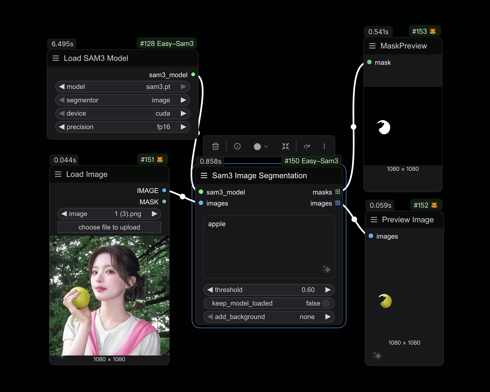
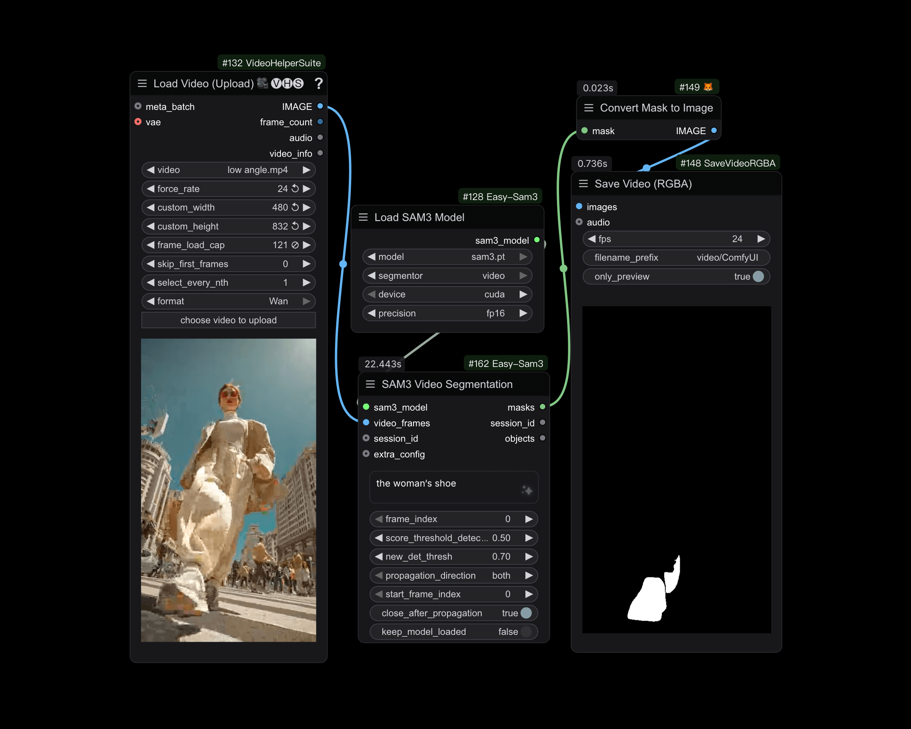

# ComfyUI-Easy-Sam3

[English](README.md) | [中文](README_CN.md)

A ComfyUI custom node package for [SAM3 (Segment Anything Model 3)](https://github.com/facebookresearch/sam3), providing powerful image and video segmentation capabilities with text prompts.

## Overview

This node package brings Meta's SAM3 model to ComfyUI, enabling:
- **Image Segmentation**: Segment objects in images using text descriptions
- **Video Tracking**: Track and segment objects across video frames
- **Advanced Configuration**: Fine-tune video tracking parameters for optimal results
- **Frames Editor**: Interactive visual editor for creating point and bounding box prompts on images and video frames

### Image Segmentation

*Example of semantic segmentation on images*

### Video Segmentation

*Example of points coordinates segmentation on video frames*

## Features

- 🖼️ **Image Segmentation**: Segment objects using natural language prompts
- �️ **Multi-Category Segmentation**: Support for comma-separated prompts to segment different object categories in a single image (e.g., "cat, dog, person")
- �🎬 **Video Segmentation**: Track objects across video frames with consistent IDs
- 🎨 **Background Options**: Add custom backgrounds (black, white, grey) to segmented images
- ⚙️ **Flexible Configuration**: Support for different devices (CUDA, CPU, MPS) and precisions (fp32, fp16, bf16)
- 🔧 **Advanced Controls**: Comprehensive video tracking parameters for fine-tuning

## Nodes

### 1. Load SAM3 Model
Load a SAM3 model for image or video segmentation.

**Inputs:**
- `model`: SAM3 model file from the models/sam3 folder
- `segmentor`: Choose between "image" or "video" mode
- `device`: Device to load the model on (cuda, cpu, mps)
- `precision`: Model precision (fp32, fp16, bf16)

**Outputs:**
- `sam3_model`: Loaded SAM3 model for downstream nodes

### 2. SAM3 Image Segmentation
Segment objects in images using text prompts and optional geometric prompts.

**Inputs:**
- `sam3_model`: SAM3 model from Load SAM3 Model node (must be in 'image' mode)
- `images`: Input images to segment
- `prompt`: Text description of objects to segment (e.g., "a cat", "person"). Supports comma-separated prompts to segment multiple object categories (e.g., "cat, dog, person"). Also supports empty string for point/box only segmentation
- `threshold`: Confidence threshold for detections (0.0-1.0, step: 0.05, default: 0.40)
- `keep_model_loaded`: Keep model in VRAM after inference (default: False)
- `add_background`: Add background color to segmented images (options: none, black, white, grey, default: none)
- `coordinates_positive` (optional): Positive point coordinates to refine segmentation. Format: JSON string like `"[{\"x\": 50, \"y\": 120}]"`
- `coordinates_negative` (optional): Negative point coordinates to exclude areas. Format: JSON string like `"[{\"x\": 150, \"y\": 300}]"`
- `bboxes` (optional): Bounding boxes to guide segmentation. Format: (x_min, y_min, x_max, y_max) or (x, y, width, height)
- `mask` (optional): Input mask for refinement

**Outputs:**
- `masks`: Combined segmentation masks (one mask per image with all detected objects merged)
- `images`: Segmented images with RGBA alpha channel (with optional background)
- `obj_masks`: Individual object masks before combining (for visualization, preserves all detected objects separately)
- `boxes`: Bounding box coordinates for each detected object [N, 4] format
- `scores`: Confidence scores for each detected object

### 3. SAM3 Video Segmentation
Track and segment objects across video frames with advanced prompting options.

**Inputs:**
- `sam3_model`: SAM3 model from Load SAM3 Model node (must be in 'video' mode)
- `session_id` (optional): Session ID to resume tracking from a previous session. If not provided, a new session will be created
- `video_frames`: Video frames as image sequence (tensor format)
- `prompt`: Text description of objects to track (e.g., "person", "car"). Supports empty string for point/box only tracking
- `frame_index`: Frame index where initial prompt is applied (min: 0, max: 100000, step: 1). Will be clamped to valid frame range
- `object_id`: Unique ID for multi-object tracking (min: 1, max: 1000, step: 1, default: 1)
- `score_threshold_detection`: Detection confidence threshold (0.0-1.0, step: 0.05, default: 0.5)
- `new_det_thresh`: Threshold for a detection to be added as a new object (0.0-1.0, step: 0.05, default: 0.7)
- `propagation_direction`: Direction to propagate masks (options: both, forward, backward, default: both)
- `start_frame_index`: Frame index to start propagation from (min: 0, max: 100000, step: 1, default: 0)
- `max_frames_to_track`: Maximum number of frames to process (min: -1, default: -1 for all frames)
- `close_after_propagation`: Close the session after propagation completes (default: True)
- `keep_model_loaded`: Keep model in VRAM after inference (default: False)
- `extra_config` (optional): Additional configuration from SAM3 Video Model Extra Config node
- `positive_coords` (optional): Positive click coordinates as JSON string. Format: `"[{\"x\": 50, \"y\": 120}]"`
- `negative_coords` (optional): Negative click coordinates as JSON string. Format: `"[{\"x\": 150, \"y\": 300}]"`
- `bbox` (optional): Bounding box to initialize tracking. Format: (x_min, y_min, x_max, y_max) or (x, y, width, height). Compatible with KJNodes Points Editor bbox output

**Outputs:**
- `masks`: Tracked segmentation masks for all frames [B, H, W] format with merged object masks per frame
- `session_id`: Session ID string for resuming tracking in subsequent calls
- `objects`: Object tracking information dictionary containing `obj_ids` and `obj_masks` arrays
- `obj_masks`: Individual object masks per frame [B, N, H, W] format where N is the maximum number of objects tracked

### 4. SAM3 Get Object IDs
Get all object IDs and count from SAM3 Video Segmentation output.

**Inputs:**
- `objects`: Objects output from SAM3 Video Segmentation node (contains `obj_ids` and `obj_masks`)

**Outputs:**
- `object_ids`: List of all object IDs that were tracked in the video
- `count`: Total number of objects tracked

**Use Case:**
This node is essential for understanding what objects were detected and tracked in your video. It helps you:
- Discover all object IDs available for extraction
- Determine how many objects were successfully tracked
- Plan downstream processing based on the number of tracked objects
- Debug tracking issues by verifying which objects were detected

**Example:**
If your video tracked 3 objects, this node will output:
- `obj_ids`: [0, 1, 2]
- `count`: 3

You can then use these IDs with the SAM3 Get Object Mask node to extract individual object masks.

### 6. SAM3 Get Object Mask
Extract mask for a specific object ID from SAM3 Video Segmentation output.

**Inputs:**
- `objects`: Objects output from SAM3 Video Segmentation node (contains `obj_ids` and `obj_masks`)
- `obj_id`: Object Index to extract mask for (min: 0, max: 1000, default: 0)

**Outputs:**
- `mask`: Extracted mask tensor for the specified object ID [B, H, W] format. Returns empty mask if object ID not found

**Use Case:**
This node is useful when you have multiple tracked objects in a video and want to isolate a specific object's mask for further processing. For example:
- Extract a person's mask (object_id=1) from a video with multiple people
- Process different objects separately in your workflow
- Apply different effects or transformations to specific tracked objects

### 7. SAM3 Video Model Extra Config
Configure advanced parameters for video segmentation to fine-tune tracking behavior.

**Parameters:**
- `assoc_iou_thresh`: IoU threshold for detection-to-track matching (0.0-1.0, default: 0.1)
- `det_nms_thresh`: IoU threshold for detection NMS (0.0-1.0, default: 0.1)
- `new_det_thresh`: Threshold for adding new objects (0.0-1.0, default: 0.7)
- `hotstart_delay`: Hold off outputs for N frames to remove unmatched/duplicate tracklets (0-100, default: 15)
- `hotstart_unmatch_thresh`: Remove tracklets unmatched for this many frames during hotstart (0-100, default: 8)
- `hotstart_dup_thresh`: Remove overlapping tracklets during hotstart (0-100, default: 8)
- `suppress_unmatched_within_hotstart`: Only suppress unmatched masks within hotstart period (default: True)
- `min_trk_keep_alive`: Minimum keep-alive value (-100-0, default: -1, negative means immediate removal)
- `max_trk_keep_alive`: Maximum frames to keep track alive without detections (0-100, default: 30)
- `init_trk_keep_alive`: Initial keep-alive when new track is created (-10-100, default: 30)
- `suppress_overlap_occlusion_thresh`: Threshold for suppressing overlapping objects (0.0-1.0, default: 0.7, 0.0 to disable)
- `suppress_det_at_boundary`: Suppress detections close to image boundaries (default: False)
- `fill_hole_area`: Fill holes in masks smaller than this area in pixels (0-1000, default: 16)
- `recondition_every_nth_frame`: Recondition tracking every N frames (-1-1000, default: 16, -1 to disable)
- `enable_masklet_confirmation`: Enable masklet confirmation to suppress unconfirmed tracklets (default: False)
- `decrease_alive_for_empty_masks`: Decrease keep-alive counter for empty masklets (default: False)
- `image_size`: Input image size for the model (256-2048, step: 8, default: 1008)

**Output:**
- `extra_config`: Configuration dictionary for Video Segmentation node

### 8. Sam3 Visualization
Visualize segmentation masks with bounding boxes and confidence scores overlaid on images.

**Inputs:**
- `image`: Input image to visualize masks on (tensor format)
- `obj_masks`: Individual object masks from Sam3 Image Segmentation node. Format: [B, N, H, W] where N is number of objects
- `scores` (optional): Confidence scores from Sam3 Image Segmentation node (min: 0, max: 1, step: 0.0001)
- `alpha`: Transparency of mask overlay (0.0-1.0, step: 0.05, default: 0.5). 0=fully transparent, 1=fully opaque
- `stroke_width`: Width of the mask border stroke in pixels (min: 1, max: 100, step: 1, default: 5)

**Outputs:**
- `visualization`: Visualized images with colored masks, borders, and confidence scores overlaid

### 9. Frames Editor
Interactive visual editor for creating point and bounding box prompts on images/video frames.

**Inputs:**
- `images`: Input image or video frames to annotate (tensor format)
- `info`: JSON string containing annotation data (automatically managed by the widget)
- `preview_rescale`: Scale factor for preview image (0.05-1.0, step: 0.05, default: 1.0). When < 1.0, the preview image is resized for better performance, and coordinates/bounding boxes are automatically converted back to original scale

**Outputs:**
- `positive_coords`: JSON string of positive point coordinates in format `"[{\"x\": 50, \"y\": 120}]"`
- `negative_coords`: JSON string of negative point coordinates in format `"[{\"x\": 150, \"y\": 300}]"`
- `bboxes`: List of bounding boxes in format `[[x1, y1, x2, y2], ...]`
- `frame_index`: Current frame index being edited (for video sequences)

**Features:**
- **Interactive Canvas**: Visual canvas displaying your images/frames
- **Point Mode**: Click to add positive points (green) or negative points (red)
- **Box Mode**: Drag to draw bounding boxes for object selection
- **Frame Navigation**: For video sequences, navigate between frames using slider/controls
- **Undo/Redo**: Full history support for all annotations
- **Clear All**: Reset button to remove all annotations
- **Real-time Preview**: See your annotations overlaid on the image

**Usage:**
1. Connect images or video frames to the `images` input
2. The widget displays an interactive canvas with your images
3. Use the toolbar to switch between Point and Box modes
4. Click (for points) or drag (for boxes) to create annotations
5. For video, use the frame slider to navigate and annotate different frames
6. Connect the outputs directly to SAM3 Image/Video Segmentation nodes

**Toolbar Controls:**
- **Undo/Redo**: Navigate through annotation history
- **Clear All**: Remove all annotations from current frame
- **Point Mode**: Add positive (left-click) or negative (right-click) points
- **Box Mode**: Drag to draw bounding boxes

**Use Cases:**
- Create precise point prompts for SAM3 Image Segmentation
- Draw bounding boxes to guide object detection
- Annotate video frames for SAM3 Video Segmentation
- Refine segmentation by adding positive and negative points
- Quick prototyping and testing of different prompt strategies

**Tips:**
- Use positive points (green) to indicate "include this region"
- Use negative points (red) to indicate "exclude this region"
- Bounding boxes provide a rough area for the model to focus on
- For video, annotations can be made on any frame index
- The editor caches image previews for better performance with large datasets

## Usage Examples

### Basic Image Segmentation
1. Load SAM3 Model (mode: image)
2. Connect to SAM3 Image Segmentation
3. Provide input images and text prompt
4. Get segmentation masks and images

### Interactive Image Segmentation with Frames Editor
1. Load SAM3 Model (mode: image)
2. Connect images to Frames Editor
3. Use the interactive canvas to add points or draw boxes
4. Connect Frames Editor outputs to SAM3 Image Segmentation
5. See real-time segmentation results based on your annotations

### Video Object Tracking
1. Load SAM3 Model (mode: video)
2. (Optional) Create Extra Config node for advanced settings
3. Connect to SAM3 Video Segmentation
4. Provide video frames and tracking parameters
5. Get tracked masks across all frames

### Interactive Video Segmentation with Frames Editor
1. Load SAM3 Model (mode: video)
2. Connect video frames to Frames Editor
3. Navigate to the frame where you want to start tracking
4. Add points or boxes to select the object
5. Connect Frames Editor outputs (including frame_index) to SAM3 Video Segmentation
6. The model will track your selected object across all frames

## Model Downloads

Download SAM3 model weights from the official repository:
- [SAM3 Models](https://huggingface.co/facebook/sam3)

Place the downloaded models in: `ComfyUI/models/sam3/`

## Requirements

- Python 3.8+
- PyTorch 2.0+
- ComfyUI
- CUDA-compatible GPU (recommended)

## Localization

This node package supports multiple languages:
- English (`locales/en/nodeDefs.json`)
- Chinese (`locales/zh/nodeDefs.json`)

## Credits

- **SAM3**：[Facebook Research](https://github.com/facebookresearch/sam3)
- **ComfyUI**：[comfyanonymous](https://github.com/comfyanonymous/ComfyUI)
- **ComfyUI-segment-anything-2** ：[ComfyUI-segment-anything-2](https://github.com/kijai/ComfyUI-segment-anything-2)
- **ComfyUI-KJNodes** ：[ComfyUI-KJNodes](https://github.com/kijai/ComfyUI-KJNodes)
- **ComfyUI-Sam3**: [ComfyUI-SAM3](https://github.com/PozzettiAndrea/ComfyUI-SAM3)

## License

This project follows the license of the original SAM3 repository.

## Contributing

Contributions are welcome! Please feel free to submit issues or pull requests.

## Changelog

### v1.0.2

- Added `easy framesEditor` node for interactive image/video frame annotation
- Fixed bug in `sam3GetObjectMask` node when outputting multiple objects

### v1.0.1

- Added `easy sam3GetObjectIds` node to get object ID list
- Added `easy sam3GetObjectMask` node to extract mask for specific object ID
- Fixed object masks not aligned with frames when `start_frame_index` is not 0

### v1.0.0

- Initial release
- Image segmentation with text prompts
- Video tracking and segmentation
- Background color options for image segmentation
- Advanced video tracking configuration
- Multi-language support (EN/ZH)
